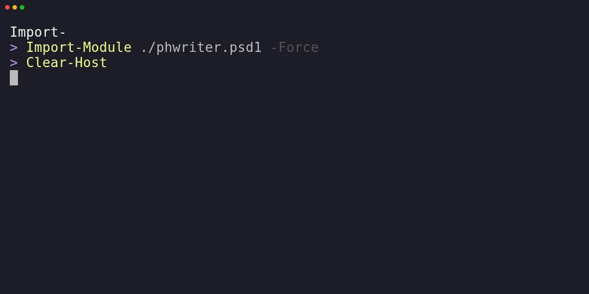

<div align="center">


<h1><b>Powershell Help Writer(PHWriter)</b></h1>

<a href='https://gitlab.com/phellams' target='_blank'></a> <a href='https://gitlab.com/phellams' target='_blank'></a> <a href='https://gitlab.com/phellams' target='_blank'></a> <a href='https://www.powershellgallery.com/packages/psshields' target='_blank'></a> <a href='https://community.chocolatey.org/packages/psshields' target='_blank'></a> <a href='https://img.shields.io/codecov/c/github/phellams/psshields?style=flat-square&logo=codecov&labelColor=%23303030&color=%23d0d0d0&logoColor=%23ffffff' target='_blank'></a> 

<span>
    <a href="https://phellams.gitlab.io/phwriter"> <strong>Docs</strong></a>
    <a href="https://www.powershellgallery.com/packages/PHWriter">| <strong>PSGallery</strong></a>
    <a href="https://chocolatey.org/packages/phwriter">| <strong>Chocolatey</strong></a>
    <a href="https://gitlab.com/phellams/phwriter">| <strong>GitLab</strong></a>
</span>

<br/><br/>


</div>

---

## Overview

PHWriter (PowerShell Help Writer) generates formatted, themed, and ANSI-colored terminal help documentation. Modeled on Linux man pages, it reads manual help data defined in JSON or PowerShell data files, or extracts metadata dynamically via Abstract Syntax Tree (AST) parsing of cmdlet source files. PHWriter supports terminal themes with customizable colors, layout variants, and borders. It features automatic console scaling, layout padding calculations, and runtime environment detection to downgrade color depth when the host terminal lacks true-color (24-bit RGB) support. String formatting and layout generation are optimized using native .NET libraries for performance.

## Module Features

* ◈ **41 Built-in Themes** — broad color palettes including solid, gradient, and hard-bordered retro styles.
* ◈ **Padded Tags** — Header tags (like `CLI`, `FUNCTION`, `VERSION`) are rendered with tag-like padded spacing for clean aesthetics.
* ◈ **AST Metadata Extraction** — Static extraction of parameter names, aliases, and descriptions from cmdlet files.
* ◈ **Interactive TUI Pager** — Native terminal scrollable view supporting keyboard navigation and alternate buffer display.
* ◈ **CLI Routing Scaffold** — Dispatch command-line subcommands with built-in tab completion and fuzzy Levenshtein distance recommendations.

---

## **Installation**

Phellams modules are available from [**PowerShell Gallery**](https://www.powershellgallery.com/packages/PHWriter) and [**Chocolatey**](https://chocolatey.org/packages/phwriter). you can access the raw assets via [**Gitlab Generic Assets**](https://gitlab.com/phellams/phwriter/-/packages?orderBy=name&sort=desc&search[]=phwriter) or nuget repository via [**Gitlab Packages**](https://gitlab.com/phellams/phwriter/-/packages/?orderBy=name&sort=desc&search[]=phwriter&type=NuGet).

|▓▓▓▓▒▒▒▒░░░|▓▓▓▓▒▒▒▒░░░|▓▓▓▓▒▒▒▒░░░|
|-|-|-|
|📦 PSGallery | <a href="https://www.powershellgallery.com/packages/phwriter"> </a> |  |
|📦 Chocolatey | <a href="https://community.chocolatey.org/packages/phwriter/"></a> |  |

### Additinonal Installation Options:
 
|▓▓▓▓▒▒▒▒░░░|▓▓▓▓▒▒▒▒░░░|▓▓▓▓▒▒▒▒░░░|
|-|-|-|
|💼 Releases/Tags | <a href="https://gitlab.com/phellams/phwriter/-/releases"> </a> | <a href="https://gitlab.com/phellams/phwriter/-/tags"> </a> |

#### GitLab Packages

Using `nuget`: See the [**packages**](https://gitlab.com/phellams/phwriter/-/packages?orderBy=name&sort=asc&search[]=phwriter&type=NuGet) page for installation instructions.

> For instructions on adding `nuget` **sources** packages from *GitLab* see [**Releases**](https://gitlab.com/phellams/phwriter/-/releases) artifacts or via the [**Packages**](https://gitlab.com/phellams/phwriter/-/packages?orderBy=name&sort=asc&search[]=phwriter&type=NuGet) page.

#### Generic Asset

The latest release artifacts can be downloaded from the [**Generic Assets Artifacts**](https://gitlab.com/phellams/phwriter/-/packages?orderBy=type&sort=desc&type=Generic) page.

#### Git Clone

```bash
# Clone the repository
git clone https://gitlab.com/phellams/phwriter.git
cd phwriter
import-module .\
```

---

## Quick Start

### 1. Rendering Help
Generate a beautiful help output with the default `phwriter` theme:
```powershell
Import-Module PHWriter
New-PHWriter -Name "MyModule" -Version "1.0.0" -Theme "phwriter"
```

### 2. Extracting Metadata Statically
Extract comment-based help, parameters, and conflict-free smart parameter aliases from your script:
```powershell
$Meta = Export-PHWriterMetadata -Path "./Public/Get-MyData.ps1"
New-PHWriter @Meta
```

### 3. CLI Routing
Build a CLI command with subcommand routing:
```powershell
$Routes = @{
    'build'   = { param($Remaining) Write-Host "Compiling..." }
    'test'    = { param($Remaining) Invoke-Pester }
    'default' = { Write-Host "Usage: mycli <build|test>" }
}
New-PHRouter -Routes $Routes -ArgumentList $args -ModuleName 'mycli'
```

---

## Documentation Site

A comprehensive Jekyll documentation site is available under the `/docs` directory. 

* ➔ **[Jekyll Docs Site Home](https://phellams.gitlab.io/phwriter)**
* ➔ **[Metadata Extraction Guide](https://phellams.gitlab.io/phwriter#metadata-extraction.md)**
* ➔ **[Interactive TUI Pager](https://phellams.gitlab.io/phwriter#tui-pager.md)**
* ➔ **[CLI Routing Guide](https://phellams.gitlab.io/phwriter#cli-routing.md)**
* ➔ **[Themes & Customization](https://phellams.gitlab.io/phwriter#docs/themes.md)**

---

## Building and Testing

### Running Tests
To run Pester tests locally:
```powershell
pwsh -Command "Invoke-Pester ./test/test-unit-pester.ps1"
```

### Building the Project
To clean, build, and package the module locally:
```powershell
./automator-devops/localbuilder.ps1 -Build -pester
```

---

## License

MIT — see [LICENSE](./LICENSE) for details.
