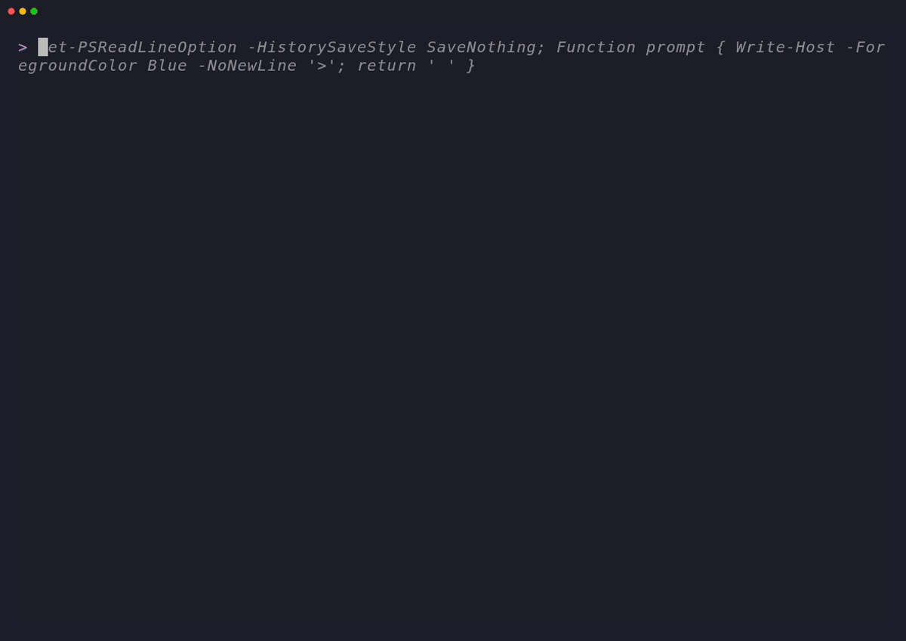
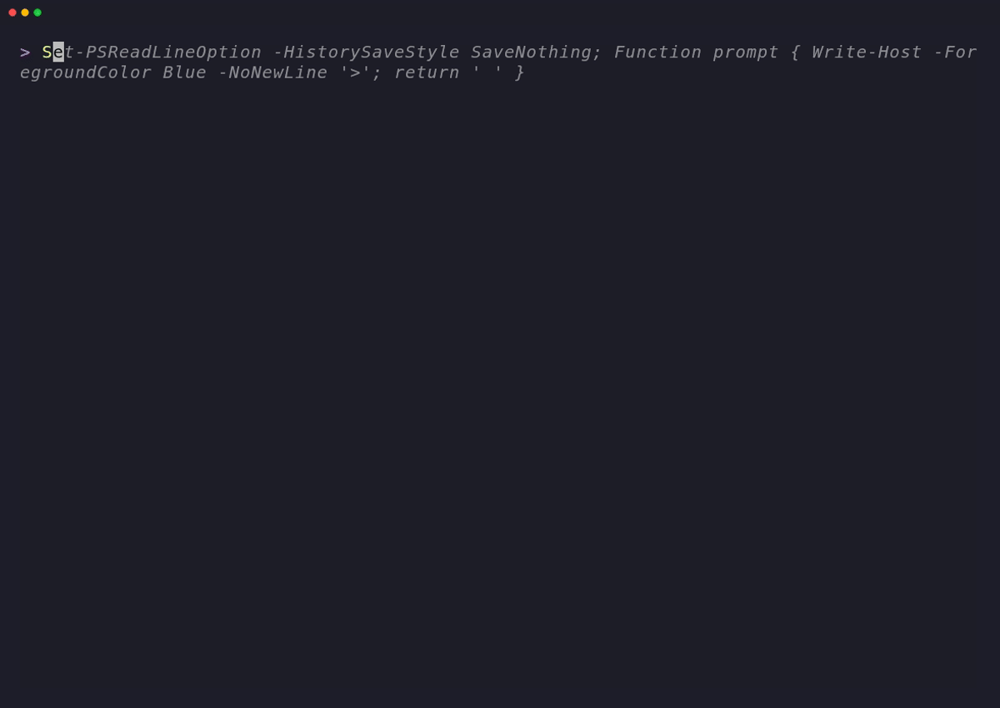
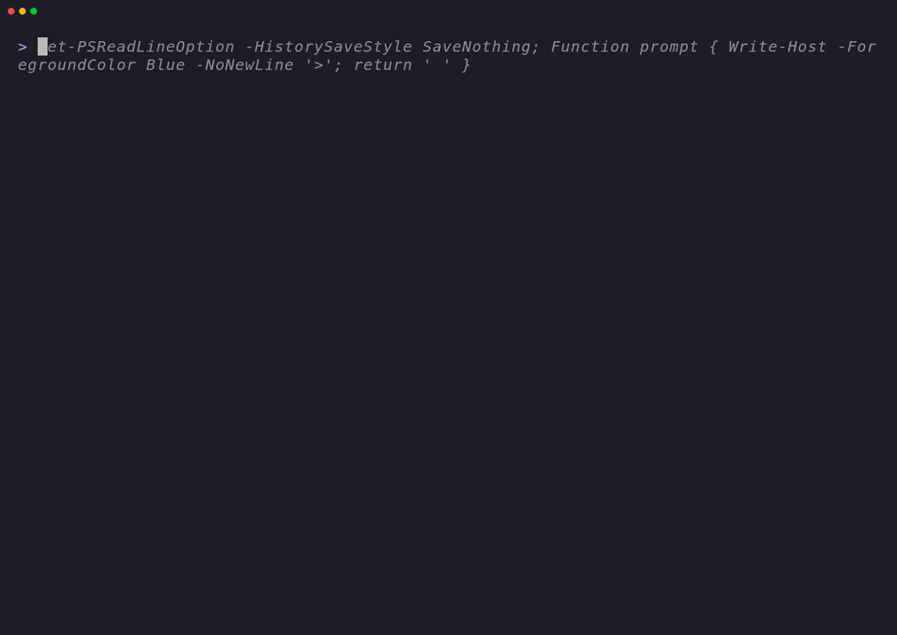

<section class="ph-hero" aria-labelledby="phwriter">
  <div class="ph-hero__content">
    <p class="ph-eyebrow">PowerShell terminal documentation</p>

    <h1 id="phwriter">PHWriter</h1>

    <p class="ph-hero__summary">Render structured, themed command help for PowerShell modules and command-line tools.</p>

    <div class="ph-hero__actions">
      <a class="ph-button" href="downloads.html">Install PHWriter</a>
      <a class="ph-button ph-button--secondary" href="themes.html">Browse 50 themes</a>
      <a class="ph-button ph-button--secondary" href="theme-variant-gallery.html">Inspect variants</a>
    </div>
  </div>

  <figure class="ph-hero__media">
    
    <figcaption>Terminal preview generated from the checked-in VHS tape.</figcaption>
  </figure>
</section>

## VHS Showcase

Each recording is generated from a tape in the repository and shows a distinct PHWriter workflow.

<div class="ph-showcase-grid">
  <figure class="ph-showcase-card">
    
    <figcaption><strong>Aurora</strong><span>Gradient header and border rendering.</span></figcaption>
  </figure>
  <figure class="ph-showcase-card">
    
    <figcaption><strong>Cyberpunk</strong><span>Full themed command help output.</span></figcaption>
  </figure>
  <figure class="ph-showcase-card">
    
    <figcaption><strong>Matrix</strong><span>Custom border-gradient configuration.</span></figcaption>
  </figure>
  <figure class="ph-showcase-card">
    
    <figcaption><strong>Custom RGB</strong><span>True-colour theme and classic layout.</span></figcaption>
  </figure>
  <figure class="ph-showcase-card">
    
    <figcaption><strong>Compact output</strong><span>Dense layout for terminal workflows.</span></figcaption>
  </figure>
</div>

---

## Feature Overview

- **50 predefined themes** — vibrant, gradient-aware, or solid retro styles matching your project's brand.
- **AST metadata extraction** — zero-touch parsing of comment-based help blocks directly from source files.
- **Interactive TUI pager** — alt-buffer terminal scrolling supporting custom width and console resize recalculation.
- **CLI router scaffolding** — subcommand dispatching with fuzzy Levenshtein recommendations and auto-completion.
- **Tag-padded headers** — modern tag blocks for clean, high-impact version metadata.

## Explore Theme Families

<div class="ph-theme-families">
  <a class="ph-theme-family" href="themes.html#1-base-themes-10"><strong>Base</strong><span>Solid palettes for broad terminal compatibility.</span></a>
  <a class="ph-theme-family" href="themes.html#2-gradient-themes-10"><strong>Gradient</strong><span>Colour ramps for headers and borders.</span></a>
  <a class="ph-theme-family" href="themes.html#3-extended-themes-20"><strong>Extended</strong><span>Distinctive terminal presentations and colour steps.</span></a>
  <a class="ph-theme-family" href="themes.html#4-hard-bordered-themes-10"><strong>Hard-bordered</strong><span>Bold frames paired with focused colour treatments.</span></a>
</div>

---

## Quick Start

Initialize, render, and page help details in seconds:

```powershell
# Import the module
Import-Module PHWriter

# Render the built-in theme preview
Show-PHTheme -Name 'phwriter'

# Generate documentation with a specific theme and compact layout
New-PHWriter @MyMetadata -Theme 'cyberpunk' -Compact
```

---

## Learning More

Use the sidebar navigation to read deep-dives on individual features, or explore:
* ➔ **[API Reference](api-reference.md)** — Fully documented parameters and syntax for all cmdlets.
* ➔ **[Installation & Downloads](downloads.md)** — PowerShell Gallery, Chocolatey, and release assets.
